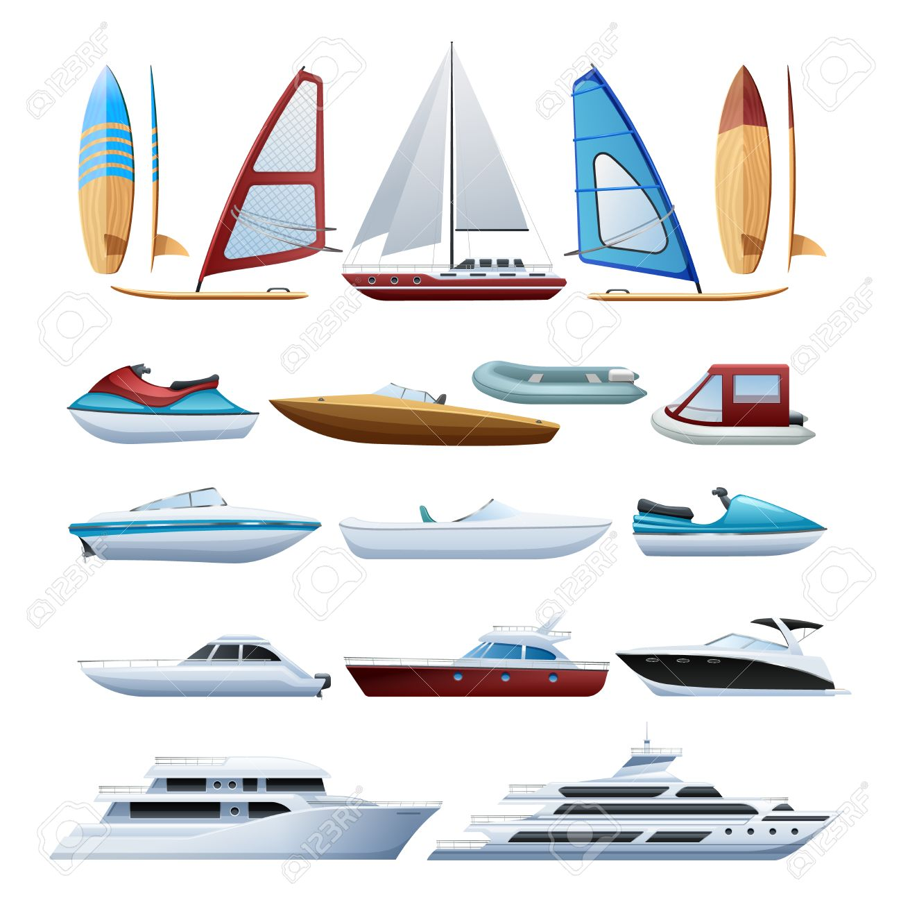
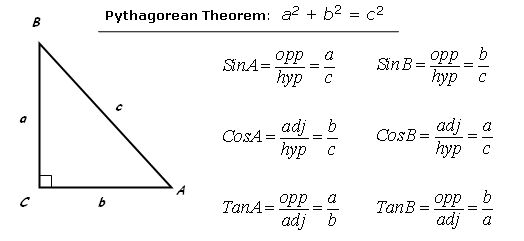
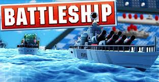

Portfolio
=========

Programming Projects
--------------------

*For access to my private project repositories, please [email me](mailto:example@csustudent.net?subject=GitHub%20Access) with the subject line, GitHub Access.

---
### [HTML Parser | CSCI 315](project1)

---
### [ Boats | CSCI 325](project2)

---
### [Right Triangle | CSCI 301](project3)

---
### [Battle Ship | CSCI 235](project4)

---

Ethics Papers
-------------

### [Copyrights](/pdf/survey_ethics_paper.pdf)

-   **Class: CSCI 301**  
-   **Grade: A**  

### [How much is to much?](/pdf/Ethics_315.pdf)

-   **Class: CSCI 315** 
-   **Grade: B**

### [What is an Ethical Hacker?](/pdf/RoboticsEthicsPaper.pdf)

-   **Class: CSCI 210** 
-   **Grade: A**

---

Presentations
-------------

### [Presentation 1 Title](/pdf/SecurityBreach.pdf)

- **Class: CSCI 301** 
- **Grade: B**

### [Sign Extender Presentation](/pdf/Sign_Extender2020.pdf)

- **Class: CSCI 330** 
- **Grade: A**

---

Page template forked from <a href="https://github.com/csu-cs/csci-portfolio">CSU-CS</a>

<!-- Remove above link if you don't want to attributive -->
