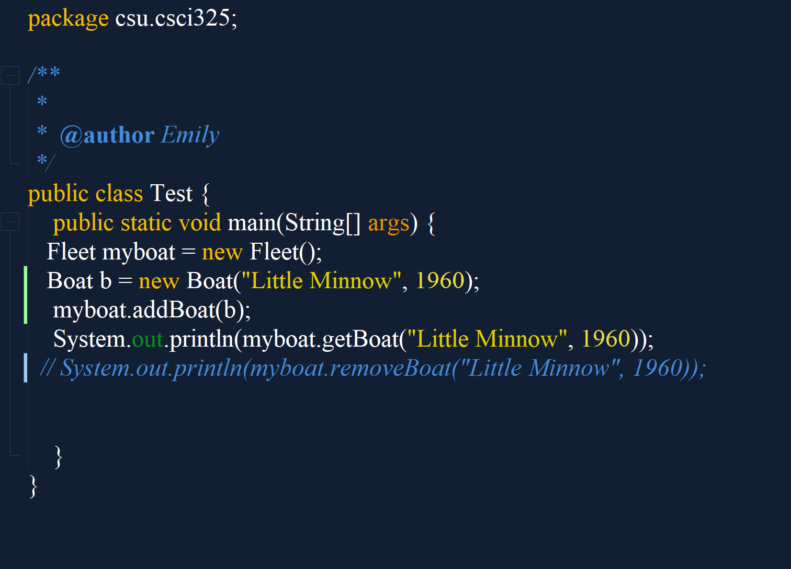
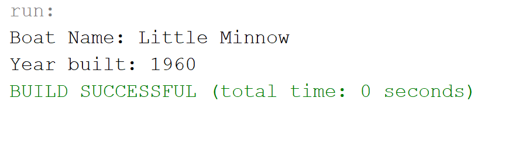

[Back to Portfolio](./)

Boats
===============

-   **Class: CSCI 325 - Object Oriented** 
-   **Grade: A**
-   **Language(s): Java**
-   **Source Code Repository: https://github.com/eharrison190736/Boats**

## Project description
This program shows how inheritance works in O-O programming. The differnet boats inherite the methods from the parent method. The boats will be able to tell the user how many passangers it is able to hold along with other information that is unique to the boat. 

## How to compiles / run the program
In netbeans click run

## UI Design

Fig 1. This is the test file that shows a boat being added

Fig 2. Example output after input is processed.

[Back to Portfolio](./)
