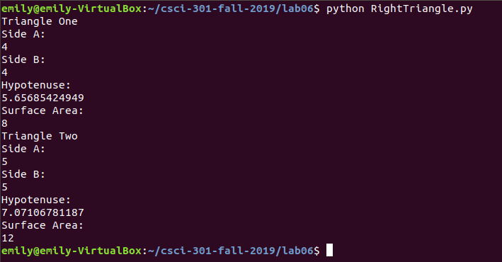

[Back to Portfolio](./)

Right Triangle
===============

-   **Class: CSCI 301 - Survey of Scripting Languages** 
-   **Grade: A**
-   **Language(s): Python**
-   **Source Code Repository: https://github.com/eharrison190736/csci-301-fall-2019/blob/master/lab06/RightTriangle.py**

## Project description
This program is able to determine the hypotenuse and surface area of a right triange. The first triangle has the sides of 4 and 4. The second triangle contains the sides of 5 and 5.

## How to compiles / run the program

```bash
python RightTriangle.py
```

## UI Design




                  Fig 1. Shows what the program looks like once it is compiled


[Back to Portfolio](./)
